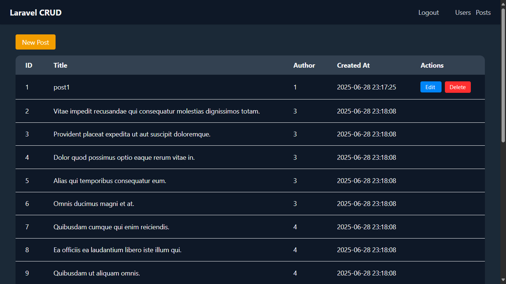
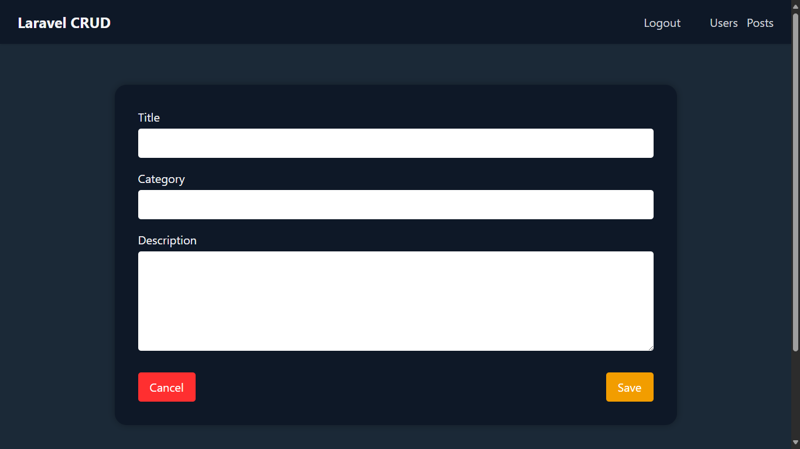
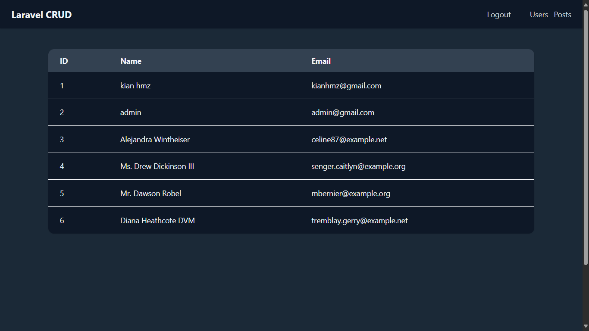
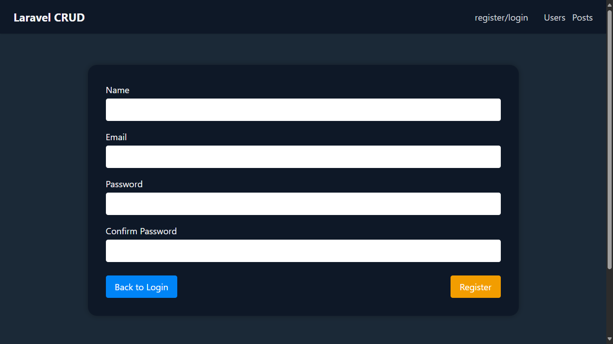
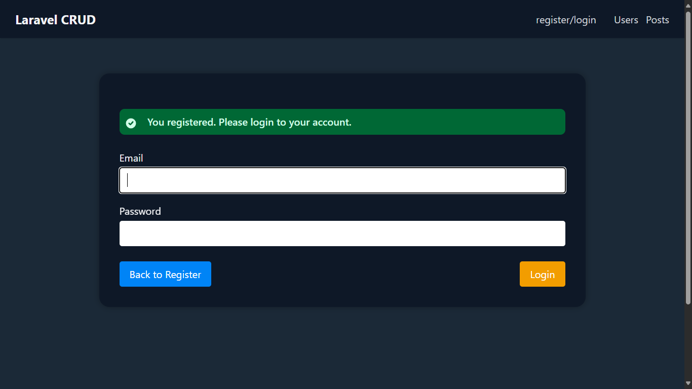

# blog management (laravel + blade)
---

## What does this app do?

- There are 2 kinds of roles: admin, user.
- Each user (except admin) can CRUD their own post, but would be able to read all the records includes posts and users list.
- Also, sign-in is required.

---

[Screenshots](#screenshots)

---

## Built With


---

## Features

- **Authentication** – Login & Registration using Laravel Breeze.
- **Authorization** – Access control using Laravel **Gate**.
- **Eloquent ORM** – Full Create, Read, Update, Delete interaction with database.
- **Form Validation** – Request classes with custom error messages.
- **Seeders & Factories** – Easily populate the database for testing/demo.
- **Clean Code Structure** – Follows MVC and PSR standards.
- **Master Layout** – Centralized layout file for consistency.
- **Responsive Design** – Mobile-friendly and usable UI.

---

## How to Use & Start

```bash
git clone https://github.com/KianHmz/blog-management-laravel.git
```

```bash
composer install
```

```bash
npm install
npm run dev
```

```bash
cp .env.example .env
php artisan key:generate
```

Edit `.env` and set your DB credentials, then run migrations and seeders:

```bash
php artisan migrate 
php artisan db:seed
```

```bash
php artisan serve
```

Visit [http://localhost:8000](http://localhost:8000) in your browser.

Use the authentication system to create a user. Try:

- Email: `admin@gmail.com`
- Password: `admin`

Or register a new user and test the full authentication + authorization flow.

---

## Screenshots







